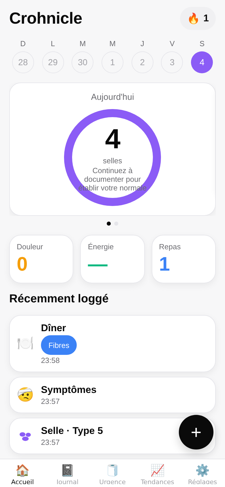
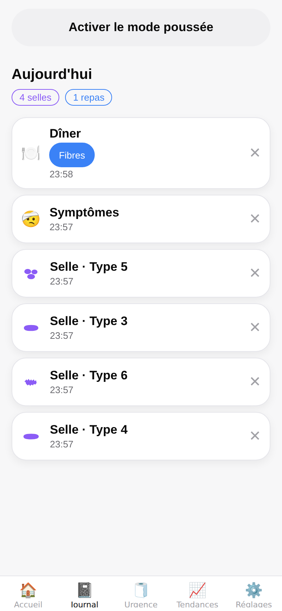
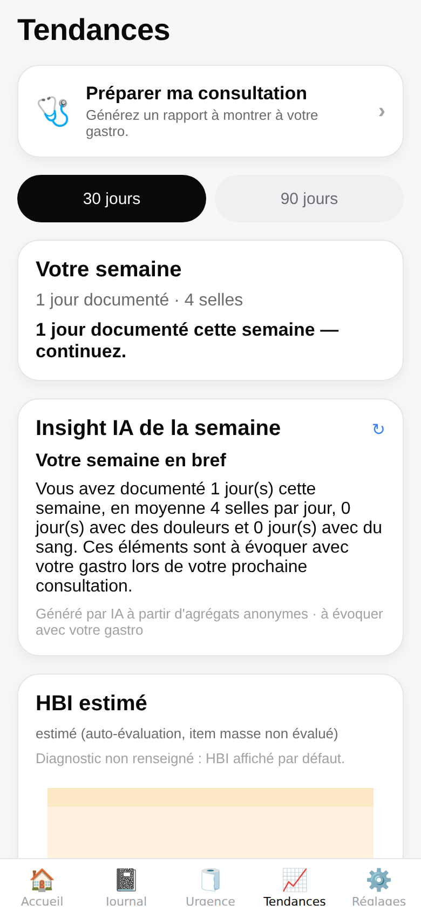
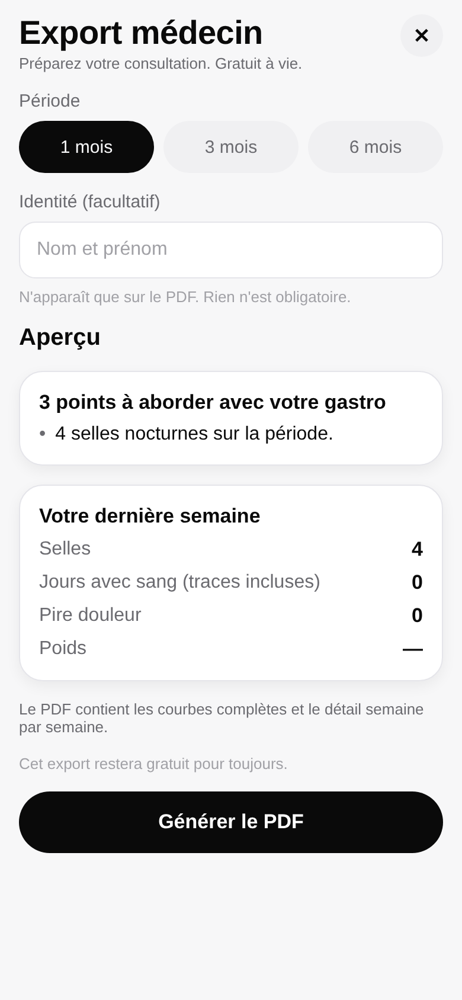
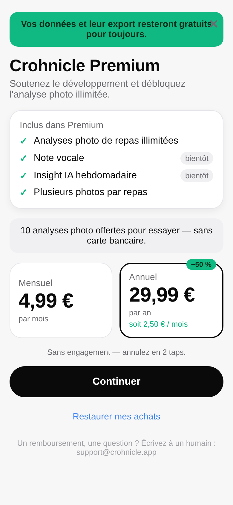
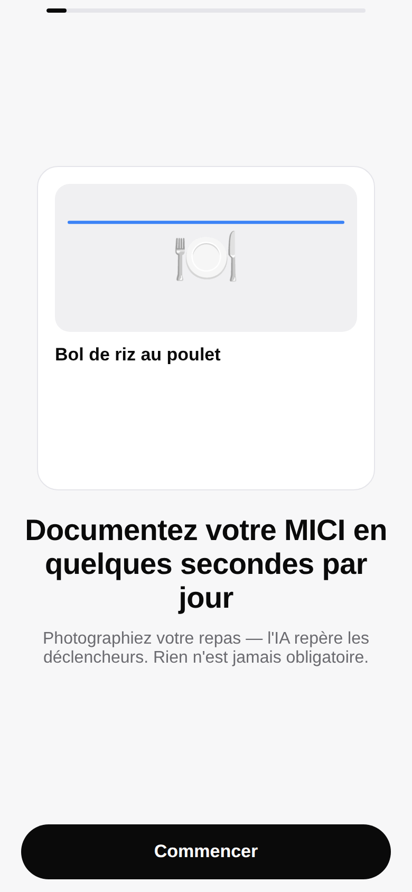
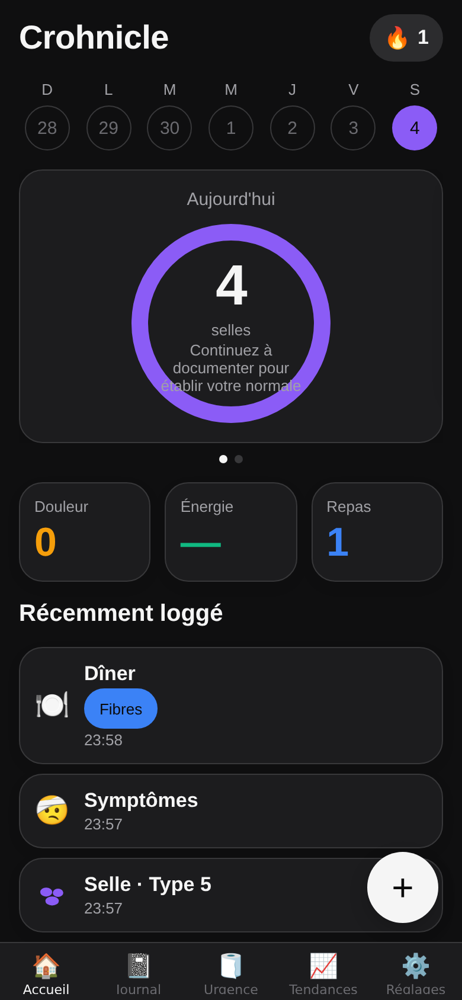

# Crohnicle

[](https://github.com/supertrampsss/openscreen/actions/workflows/ci.yml)
[](./LICENSE)
[](#avertissement-médical)
[](https://expo.dev)

**Le compagnon MICI de référence francophone.** Documenter sa maladie en quelques secondes par jour, comprendre ses déclencheurs, et arriver armé chez son gastro-entérologue. — *« Votre compagnon MICI »*

Crohnicle est une application mobile (iOS / Android / Web) destinée aux personnes atteintes d'une maladie inflammatoire chronique de l'intestin (MICI — maladie de Crohn et rectocolite hémorragique). Elle transforme le suivi quotidien des symptômes, des repas et des traitements en un geste rapide et sans anxiété, puis restitue des tendances et un export lisible pour la consultation médicale.

## Les 4 lois du produit

Tout arbitrage produit, design ou technique se tranche dans cet ordre de priorité :

1. **Zéro friction** — toute action quotidienne tient en ≤ 10 secondes et ≤ 3 taps. Photo, voix et saisie manuelle convergent vers le même pipeline « brouillon pré-rempli → confirmation en 1 tap ». Aucun champ obligatoire, des défauts intelligents.
2. **Zéro perte de données** — SQLite en mode WAL transactionnel, brouillon auto-sauvegardé à chaque tap, suppressions douces (soft delete), sauvegarde en 1 tap.
3. **Jamais anxiogène** — pas de score de « santé » culpabilisant, série (streak) gelée automatiquement pendant une poussée, ton bienveillant, pas de rouge alarmiste.
4. **Privacy structurelle** — les données de santé restent à 100 % sur l'appareil, le proxy IA est sans état et ne stocke rien, pas d'analytics tiers, pas de compte obligatoire.

## Fonctionnalités

- **Saisie éclair** : selle rapide (3 taps, < 5 s), symptômes de fin de journée, repas manuel avec recherche d'aliments FR (~300 aliments pré-taggés).
- **Analyse photo IA** : une photo de repas → ingrédients et attributs déclencheurs pré-remplis, confidence affichée, « Corriger », jamais d'échec silencieux.
- **Note vocale** (Premium) : dictée **sur l'appareil** → entrées structurées à valider (aucun audio n'est envoyé).
- **Accueil** : anneau de complétude du jour, série « jours documentés » (gelée en poussée), semaine glissante, courbe HBI/SCCAI.
- **Tendances** : courbes 30/90 j, score d'activité (HBI/SCCAI), associations alimentaires avec garde-fous statistiques, bilan hebdo local, **insight IA hebdomadaire** (Premium, agrégats anonymes).
- **Export médecin** (gratuit à vie) : PDF période 1/3/6 mois, courbes, tableaux, « 3 points à aborder avec votre gastro ».
- **Traitements** : rappels à cycle long pour biothérapies, observance, effets secondaires.
- **Urgence toilettes** : carte d'urgence multilingue, toilettes à proximité (OpenStreetMap).
- **Freemium éthique** : cœur gratuit à vie, Premium (IA illimitée) — prix affichés d'emblée, jamais de second flow d'achat, remboursement humain.

## Stack technique

- **Expo / React Native** SDK 57 (expo-router, TypeScript) — cibles iOS, Android et Web.
- **SQLite local-first** (expo-sqlite + drizzle-orm, WAL, migrations versionnées) — données de santé stockées et traitées localement.
- **Domaine pur** (`src/domain/**`, zéro import RN) : scores HBI/SCCAI, corrélations, dates, agrégats — testé sous Node (Vitest + fast-check).
- **Proxy IA** stateless (Cloudflare Worker, `server/`) pour l'analyse photo, la note vocale et l'insight hebdo — aucune donnée de santé stockée côté serveur.
- **Outillage** : Biome (lint + format), i18next (FR/EN, contrôle de dérive de clés), Playwright (E2E web), Husky + lint-staged.

## Démarrage rapide (dev)

```bash
nvm use                 # Node 22 (voir .nvmrc)
npm ci                  # dépendances (lockfile intact)
npm run start           # Expo dev server (i/a/w pour iOS/Android/Web)

# Qualité (mêmes checks qu'en CI)
npm run lint            # Biome
npm run typecheck       # tsc --noEmit
npm run test            # Vitest (domaine, migrations, Worker)
npm run i18n:check      # parité des clés FR/EN
npm run build:web       # export web statique
PW_CHROMIUM_PATH=/opt/pw-browsers/chromium npx playwright test   # E2E web
```

L'app tourne **sans backend** : sans `EXPO_PUBLIC_AI_PROXY_URL`, l'IA passe en mode démo (réponses simulées marquées « démo ») ; l'abonnement passe par un provider mock (`EXPO_PUBLIC_ENTITLEMENTS=mock` par défaut). Voir [`docs/RELEASE.md`](./docs/RELEASE.md) pour le passage en production (RevenueCat, EAS, déploiement du Worker).

## Structure du dépôt

```
app/            Routes expo-router (onglets Accueil·Journal·Urgence·Tendances·Réglages, sheets de saisie, export, premium…)
src/
  components/   Design system (RingCard, TapRow, DraftSheet, ChipTrigger, LineChart/Sparkline SVG maison…)
  db/           Schéma drizzle + client expo-sqlite (patché pour le web)
  domain/       Modules PURS testables : hbi, sccai, correlations, dates, streak, voiceEntries, insightAggregates…
  repositories/ Accès données (symptômes, repas, foods, traitements, réglages, cache d'insights)
  features/     Écrans composés par domaine (log, onboarding, premium, flare, notifications, trends…)
  services/     Effets de bord (scan photo, voix, insight hebdo, entitlements, notifications, backup…)
  i18n/         FR (base) + EN, 11 namespaces
  theme/        Tokens de design, typographie
server/         Cloudflare Worker IA (/analyze-meal, /parse-voice, /weekly-insight) + tests
drizzle/        Migrations SQL commitées
scripts/        Utilitaires (contrôle i18n, génération des icônes)
e2e/            Specs Playwright (web)
docs/           RELEASE.md (go-live), DEPLOY_WORKER.md, PRODUCT_AUDIT.md
```

## Analyse IA (proxy)

L'app n'appelle **jamais** Anthropic directement : elle passe par un Cloudflare Worker stateless ([`server/`](./server)) qui garde la clé API côté serveur, applique le quota d'essai (10 photos offertes, sans carte bancaire) et vérifie l'entitlement `premium`. Le Worker utilise `claude-haiku-4-5` (vision + sorties structurées), avec des prompts **figés et cachés** :

- `/analyze-meal` — photo → attributs déclencheurs. Quota d'essai OU premium.
- `/parse-voice` — **texte seul** (STT sur l'appareil ; jamais d'audio) → entrées structurées. **Premium.**
- `/weekly-insight` — **agrégats anonymes seuls** → insight hebdo bienveillant. **Premium.**

**Les photos ne sont jamais stockées**, les logs ne contiennent aucun contenu, et le test d'agrégats anonymes (`src/domain/insightAggregates.test.ts`) est **contractuel** : aucune note libre ni date précise ne peut fuiter. Déploiement pas-à-pas : [`docs/DEPLOY_WORKER.md`](./docs/DEPLOY_WORKER.md).

## Tests & CI

CI GitHub Actions (Node 22) : Biome · tsc + expo-doctor · Vitest (domaine + migrations + Worker) · contrôle i18n · E2E Playwright web (log → journal → reload → persistance). Domaine pur testé avec fast-check (monotonicité et bornes des scores). Voir [`.github/workflows/ci.yml`](./.github/workflows/ci.yml).

## Captures d'écran

Générées automatiquement depuis l'export web (`npm run screenshots` → [`scripts/screenshots.mjs`](./scripts/screenshots.mjs) pilote Playwright et seed les données via l'UI) ; elles servent aussi de base à l'ASO (§ [`docs/RELEASE.md`](./docs/RELEASE.md)).

| Accueil | Journal | Tendances |
|:---:|:---:|:---:|
|  |  |  |
| Export médecin | Carte d'urgence | Premium |
|  |  |  |
| Onboarding | Accueil (sombre) | |
|  |  | |

## Avertissement médical

**Cette application n'est pas un dispositif médical et ne remplace pas un avis médical.** Les scores et tendances (HBI, SCCAI, associations alimentaires) sont des auto-évaluations à visée informative et de préparation à la consultation. En cas de symptôme préoccupant, consultez un professionnel de santé.

## Crédits & benchmark

Produit conçu à partir d'un benchmark de l'écosystème des apps MICI (étude Mount Sinai sur 1 512 apps « IBD », mining des stores et des communautés FR) : le secteur meurt d'abandon, l'export médecin est la fonction unanimement louée, et il existe un **vide francophone total**. Le design s'inspire du funnel et de la sobriété de Cal AI, en **retirant ses toxicités** (prix cachés, second flow d'achat, échecs silencieux, fuite de données santé). Détails dans la description de la PR.

## Licence

Distribué sous licence MIT (voir [`LICENSE`](./LICENSE)). Ce dépôt est une reconversion du fork open source `openscreen` ; le copyright original est conservé aux côtés de celui des contributeurs Crohnicle.

## English

**Crohnicle** is a French-first mobile companion for people living with inflammatory bowel disease (IBD — Crohn's disease and ulcerative colitis). It makes daily tracking of symptoms, meals and treatments a fast, calm, few-seconds-a-day habit, then surfaces trends and a clinician-ready export. Meal photo analysis, on-device voice notes, and a weekly AI insight run through a stateless AI proxy that stores nothing; health data stays 100% on the device. Built with Expo / React Native and local-first SQLite. **This app is not a medical device and does not replace professional medical advice.** MIT-licensed; repurposed from the open source `openscreen` fork.
